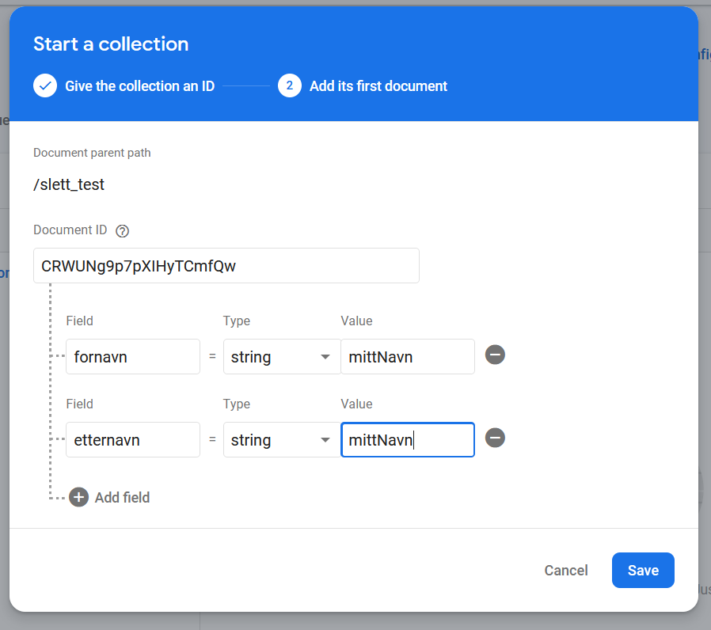
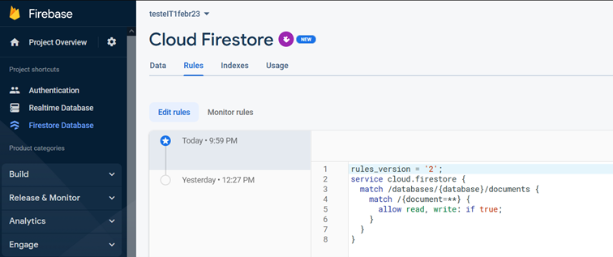
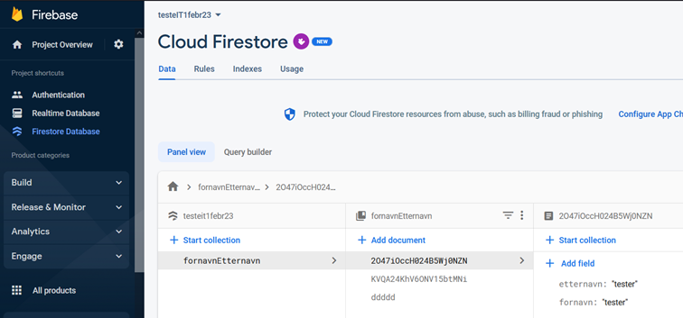
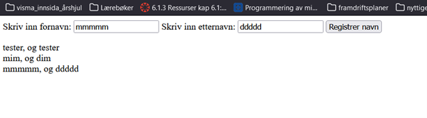

# Firebase database

## Opprette prosjekt i firebase
Opprett en profil - eller logg inn på - [Firebase sine nettsider](https://firebase.google.com)


Gå til console etterpå (lenke oppe til høgre i vindu) - [Firebase sin konsoll](https://console.firebase.google.com)


Opprett et Firebase prosjekt ved å klikke 'Add project' i Firebase konsollen. Følg instruksjonene på skjermen.  

Disable Google Analytics hvis du ikke vil 'ha noe med dem å gjøre' :)

Når du kommer til sida "Get started by adding Firebase to your app" velger du web-ikonet ( </> ) og gir appen et navn (du trenger ikke firebase hosting).

Kode-snuttene du får opp videre kan vi finne igjen i prosjektets Settings, så vi trykker knappen continue to console.
Velg den store, oransje knappen Cloud Firestore og videre create database. 

Velg 'Test mode' når du får valget mellom denne og 'Locked mode'. Test mode er gratis i en periode.

Velg eur3(Europe) for lagring av data.
(hvis du får en feilmelding her: steng popupvinduet og velg f.eks realtime database til venstre i menyen (kun for å gå ut av firestore). Deretter trykker du på Firestore database igjen - da vil du se databasen din.)
Nå kan du legge inn data manuelt i databasen. Lag en collection, og opprett to-tre dokumenter. 



[comment]: <> (ved å legge inn bilde som html kan jeg sette bredde og høyde på bildet)


Husk å endre i fanen Rules: read og write skal settes til 'true', ikke 'false'!


Nå er databasen klar.



I et cmd-vindu (eller i terminal i Visual Studio Code) - skriv inn `npm install firebase` for å installere alle moduler. 


## HTML-kode


Bildet viser inntastingsskjema fra html-kode og utskrift henta fra databasen etterpå.


```html
<!DOCTYPE html>
<html lang="en">
<head>
    <meta charset="UTF-8">
    <meta http-equiv="X-UA-Compatible" content="IE=edge">
    <meta name="viewport" content="width=device-width, initial-scale=1.0">
    <title>Firebase</title>
    <script src="firebaseV23.js" type="module"></script>
```
Legg merke til at vi må sette type til module i script-taggen. Det er fordi firebase 9 er modulbasert. 
```html
</head>
<body>
    <form action="#">
        <label for="fornavn">Skriv inn fornavn: </label>
        <input type="text" id="fornavn">
        <label for="etternavn">Skriv inn etternavn: </label>
        <input type="text" id="etternavn">
        <button type="button" id="leggTilKnapp">Registrer navn</button>
    </form>
    <p id="utskriftAvsnitt"></p>
</body>
</html>
```
 

## JavaScript-kode

```javascript
// Import the functions you need from the SDKs you need
import { initializeApp } from 'https://www.gstatic.com/firebasejs/9.6.10/firebase-app.js';
//import { getAuth } from 'https://www.gstatic.com/firebasejs/9.6.10/firebase-auth.js';
import {
    getFirestore,
    collection,
    getDocs,
    query,
    //addDoc,
    //onSnapshot,
    doc,
    setDoc
} from 'https://www.gstatic.com/firebasejs/9.6.10/firebase-firestore.js';
const firebaseConfig = {
    apiKey: "Sett inn din egen apiKey her",  
    authDomain: "testeit1febr23.firebaseapp.com",  
    databaseURL: "https://testeit1febr23-default-rtdb.europe-west1.firebasedatabase.app",  
    projectId: "testeit1febr23",  
    storageBucket: "testeit1febr23.appspot.com",  
    messagingSenderId: "363940739359",  
    appId: "1:363940739359:web:079d0619fe961150ded82a"  
  };
  
// Initialize Firebase
const app = initializeApp(firebaseConfig); 
const db = getFirestore();
const q = query(collection(db, 'fornavnEtternavn')); 
const dokumenter = await getDocs(q); //await venter til vi har henta dokumentene fra databasen  
dokumenter.forEach((dokument) => { // funksjon - dokument er en variabel
    console.log(dokument.data().fornavn);
    
document.querySelector("#utskriftAvsnitt").innerHTML +=dokument.data().fornavn+", og " + dokument.data().etternavn +" " +"<br>";
});
let inputEl1 = document.querySelector("#fornavn");
let inputEl2 = document.querySelector("#etternavn");
document.querySelector("#leggTilKnapp").addEventListener("click", leggTilPunkt);
//setDoc gir deg mulighet til å bestemme unik id
function leggTilPunkt(){
 
    setDoc(doc(db, "fornavnEtternavn", inputEl2.value),{  //siste parameter er unik id. bør ikke være etternavnet til personen, slik det er satt opp her ;)
        fornavn: inputEl1.value,
        etternavn: inputEl2.value
    });
}
```
Nå skal du kunne fylle ut skjemaet, og observere at dataene lagres i databasen. Dataene hentes også fra databasen, og skrives ut under skjemaet på nettsida.


## Secure your data - i firebase
(Disse lenkene er muligens utdaterte. Endringer skjer hyppig hos firebase)

Se [rules tab nederst](https://firebase.google.com/docs/firestore/quickstart#web-version-9) på Firebase sin side.

Lær om oppstart i en [youtube-video](https://youtu.be/BjtxPj6jRM8)
